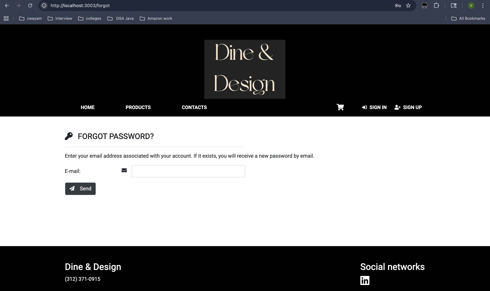

# Dine & Design Ecommerce Platform

<p align="center">
  
</p>

Modern, full-stack Ecommerce platform for food and furniture, built with React.js and Java Spring Boot. Enjoy seamless shopping, admin management, and a beautiful UI.

---

## Table of Contents
- [Demo](#demo)
- [Features](#features)
- [Screenshots](#screenshots)
- [Tech Stack](#tech-stack)
- [Getting Started](#getting-started)
- [Project Structure](#project-structure)
- [Contributing](#contributing)
- [License](#license)

---

## Demo

### Homepage
<p align="center">
  
</p>

---

## Features

- User registration, login, and authentication
- Product browsing, search, and filtering
- Shopping cart and order management
- Admin dashboard for product/user management
- Responsive design for all devices
- Toast notifications and loading spinners
- Secure RESTful API with Spring Boot

---

## Screenshots


### Landing Page & Brands
<p align="center">
  
</p>

### Homepage Carousel
<p align="center">
  
</p>

### Product List (User View)
<p align="center">
  
</p>

### Product List (Admin View)
<p align="center">
  
</p>

### Add Product (Admin)
<p align="center">
  
</p>

### User List (Admin)
<p align="center">
  
</p>

### Forgot Password
<p align="center">
  
</p>

### Change Password
<p align="center">
  
</p>

### Orders List (User)
<p align="center">
  
</p>

### Order Finalize (Thank You)
<p align="center">
  
</p>

### Payment Success
<p align="center">
  
</p>

### Payment Processing
<p align="center">
  
</p>

### Order Details & Checkout
<p align="center">
  
</p>

### Cart
<p align="center">
  
</p>

### Login
<p align="center">
  
</p>

### Registration
<p align="center">
  
</p>

### Contacts
<p align="center">
  
</p>

---

## Tech Stack

**Frontend:**
- React.js
- Redux
- Axios
- CSS3

**Backend:**
- Java Spring Boot
- Spring Security
- JPA/Hibernate
- MySQL

---

## Getting Started

### Prerequisites
- Node.js & npm
- Java 11/17+
- Maven
- MySQL

### Backend Setup
1. Create a database in PostgreSQL with the name **`store`**.
2. Open `pom.xml` and run **Maven Clean** followed by **Maven Install**.
3. Navigate to the `EcommerceApplication` class in the backend code and run it as a **Java application**.


### Frontend Setup
```bash
cd ecommerce-spring-reactjs/frontend
npm install
npm start
```

### Database Setup
- Configure your MySQL credentials in `src/main/resources/application.properties`.
- The app will auto-create tables on first run.

---

## Project Structure

```
/ecommerce-spring-reactjs
  ├── frontend/           # React frontend
  ├── src/                # Java backend
  ├── pom.xml             # Maven config
  └── ...
```

## License

This project is licensed under the MIT License. See the [LICENSE](./ecommerce-spring-reactjs/LICENSE) file for details.

---

## Credits

- UI/UX inspired by modern ecommerce platforms
- Built with ❤️ by Vrushabh Shet

---

<p align="center">
  
  
  
  
  
  
  
  
  
  
  
  
  
  
  
  
  
</p>
